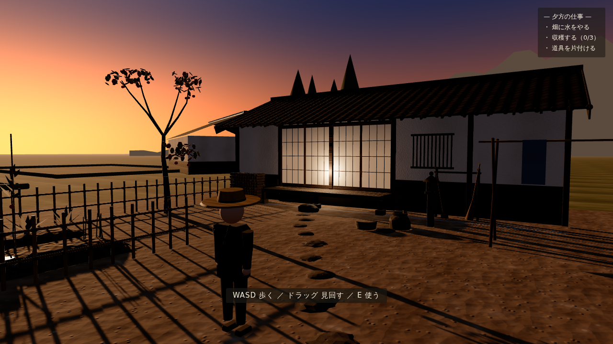

# ほの暮しの庭

夕暮れの田舎家の坪庭を歩き、水をやり、収穫し、道具を片付ける——
小さな「暮らし」の3Dゲーム。Three.js + Vite + TypeScript 製。



## 遊び方

```bash
npm install
npm run dev        # http://localhost:5173
```

| 操作 | 内容 |
|---|---|
| WASD / 矢印 | 歩く |
| マウスドラッグ | 見回す（2秒で背後へ自動復帰） |
| ホイール | ズーム |
| E | 使う（如雨露を取る・水を汲む・水をやる・収穫・片付け） |

夕方の仕事: 畑に水をやる ／ 3つ収穫する（大根・トマト・柿）／ 道具を片付ける。

## 設計

- **ビジュアルの原則**: 近景（坪庭）・中景（隣家と田）・遠景（里山）の3層を
  シルエット・材質・照明・空気遠近で分離。全ジオメトリは実寸
  （尺モジュール: 柱105mm角・縁側高450mm・4寸勾配…）を `src/scene/layout.ts`
  に定数として持ち、ユニットテストが同じ定数で寸法を検証する。
- **AI生成CGの癖の排除**: 角は実物どおりの平面取りのみ（`chamferBox`）、
  艶は roughness マップ＋個体ジッター、摩耗・汚れは
  「雨だれは軒先の投影線の下」「苔は日陰の低所」「泥はねは塀の下端」など
  原因→結果のロジックで配置（シードで非対称）。ポストプロセス
  （ブルーム・DOF・ビネット）は不使用。発光は障子越しの行灯ひとつだけ。
- **ロジックと描画の分離**: `src/sim/` は three.js に依存しない純関数。
  60Hz固定ステップ。テストは `window.__game.step(n)` で論理時間を決定的に
  進められる（`?e2efast=1`）。
- **テクスチャ**: 手続き生成PBR（`src/materials/texgen/`）で完全自己完結。
  ネットワークの開いた環境で `npm run fetch:textures` を実行すると
  Poly Haven の CC0 スキャン（縮小WebP）を `public/textures/` に取得し、
  起動時に自動で差し替わる（失敗しても手続き生成で動く）。

## 開発

```bash
npm run verify      # lint → typecheck → unit（CLAUDE.md の検証順）
npm run test:e2e    # Playwright smoke（クラウドでは PW_CHROMIUM_PATH=/opt/pw-browsers/chromium）
npm run build && npm run preview
node scripts/screenshot.mjs out.png "?test=1&seed=42&cam=2,1.6,4&look=0,1,-3"
```

- `?seed=N` ワールドシード（同一シード=バイト一致のジオメトリ）
- `?cam=x,y,z&look=x,y,z` 検分用固定カメラ
- `?debug=shadow` 影フラスタムの可視化

## ハードウェア環境での最終画質チェックリスト

SwiftShader（ソフトウェアGL）ではFPS・アンチエイリアス・影の品質を
判定できない。GPUのあるローカルで以下を確認する:

1. 影: 太陽高度12°のレーキング光でアクネ/ピーターパンが出ていないか
   （出る場合は `GoldenHourRig.ts` の normalBias、または太陽高度を15°へ）
2. 露出: `App.ts` の `toneMappingExposure`（1.15〜1.3で好み調整）
3. 60fps: `?debug=shadow` を切った状態で維持できるか
4. 多角度: 縁側から／木戸から／塀際から見て破綻（浮き・貫通・裏面）がないか

## ライセンス

コードは MIT。取得した場合のテクスチャは CC0（`public/textures/CREDITS.md`）。
