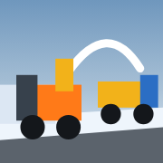

# ロータリじょせつしゃ — Rotary Snow Blower

雪の壁をぐるぐる吸って、トラックにドバーッと飛ばす。
4歳児向けの、指1本で遊べるモバイルWebゲームです。



## あそびかた（文字は読めなくて大丈夫）

| やること | 指の動き |
| --- | --- |
| 前へすすむ | 画面を上へスワイプ（押しっぱなしでもOK） |
| シュートの向きをかえる | 画面を左右へスワイプ |
| 荷台をかたむける | 大きなレバーを長おし |

1. 雪の壁にロータリ除雪車をぶつけて、雪を吸いこむ
2. シュートから飛んだ雪が、となりを走るダンプの荷台に入る
3. 荷台がいっぱいになると、雪堆積場へ案内される
4. レバーを長おしすると荷台が傾いて、雪がドサッと落ちる
5. また新しい雪の壁があらわれて、くりかえし遊べる

失敗も、制限時間も、点数もありません。

## 動かす

静的ファイルだけなので、どんなHTTPサーバーでも動きます。

```sh
python3 -m http.server 8000
# → http://localhost:8000/ をiPhone / iPadのSafariで開く
```

`file://` からは ES modules が読めないため、必ずHTTP経由で開いてください。

## 技術メモ

- **WebGL 3D（three.js）** — CSSの疑似3Dではなく、透視投影・遮蔽・被写界の視差がある実際の3D空間。
  `vendor/` にthree.jsを同梱しているので、CDNもビルドも不要でオフラインで動きます。
- **アセットゼロ** — 圧雪・濡れたアスファルト・塗装の摩耗・泥はね・道路標識・ビル外壁のテクスチャは、
  すべて起動時にCanvas 2Dで生成しています（`src/textures.js`）。
- **音もゼロアセット** — エンジンの低音、オーガーの回転音、シュートを雪が通るザザー音、
  荷台に積もるドスドス音、堆積場の重量音はWebAudioで合成しています（`src/audio.js`）。
  iOSの制約に合わせ、最初のタッチでAudioContextを起動します。
- **カメラは自動演出** — プレイヤーは回転させません。街路全景 → オーガーの食い込み →
  雪の軌跡と荷台 → 雪山、と場面ごとに最適な画角へ寄ります（`src/camera.js`）。
- **強い吸着補正** — シュートの狙いがずれても、雪の初速を弾道解に寄せ、飛行中も軽く誘導して
  荷台に入ります（`src/main.js` の `emitSnow`）。
- **無限の街路** — 路面・地面はカメラ追従＋UVスクロール、標識/電柱/建物/雪壁はプールを
  リサイクルしているので、どこまで走っても街が続きます。

### ファイル構成

```
index.html          画面とオーバーレイUI（ピクトグラムのみ、文字なし）
src/main.js         ゲームループと状態遷移
src/world.js        街路・空・光・雪堆積場
src/plow.js         ロータリ除雪車（オーガー/シュート/油圧/キャタ…）
src/truck.js        ダンプカー（荷台の雪山・ティルト）
src/snowwall.js     圧雪の雪壁（削られて減る）
src/effects.js      雪の粒・飛雪・排煙・降雪
src/camera.js       カメラ演出
src/input.js        1指ジェスチャ
src/audio.js        効果音の合成
src/ui.js           オーバーレイ操作
src/materials.js    共有マテリアル
src/textures.js     手続き的テクスチャ生成
src/geo.js          ジオメトリ補助（螺旋オーガー等）
vendor/             three.js（MIT）
```

## 対応

iPhone / iPad の Safari、縦・横どちらでも動作します。
画面サイズに応じてカメラの引きと画角が自動で変わり、操作系はセーフエリアを避けて配置されます。
端末が重い場合は解像度とシャドウを自動で落とします。
